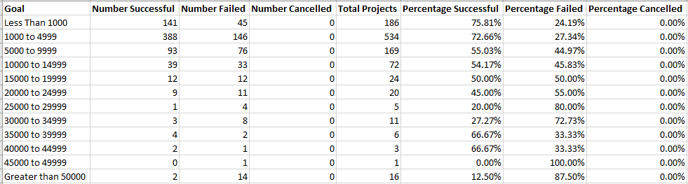

# Kickstarting with Excel

## Overview of Project
This project utilizes Microsoft Excel tools to evaluate the success or failure of Kickstarter campaigns for Louise's play "Fever". Specifically, the project analyzes the correlation between goal amounts and outcomes (i.e. success or failure), and launch dates and outcomes.

## Analysis and Challenges
In order to perform the analysis, a pivot table and line graph were created to visually represent and more easily compare the correlations.  

A pivot table was created in order to easily arrange data and filter to appropriate years and categories for launch months and outcomes. For the purposes of this project, categories were filtered to "theater," "all" years, and display data for all months. 

A standard table utilizing the COUNTIFS function was used to filter the appropriate data, and easily create a line graph to illustrate success or failure based on goal amounts and outcomes.  
*An example "COUNTIFS" formula:  =COUNTIFS(Kickstarter!$F:$F,"successful",Kickstarter!$D:$D,">=1000",Kickstarter!$D:$D,"<=4999",Kickstarter!$R:$R,"plays")

By doing so, we can easily and quickly view the potential correlations between success (or the lackthereof) and campaign start months 

### Analysis of Outcomes Based on Launch Date

### Analysis of Outcomes Based on Goals

### Challenges and Difficulties Encountered

## Results

- What are two conclusions you can draw about the Outcomes based on Launch Date?

- What can you conclude about the Outcomes based on Goals?

- What are some limitations of this dataset?

- What are some other possible tables and/or graphs that we could create?
