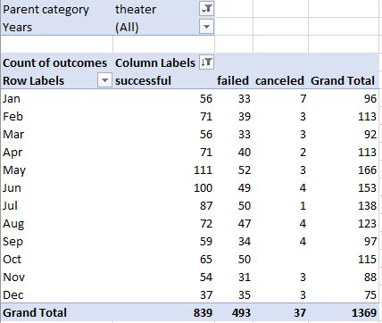
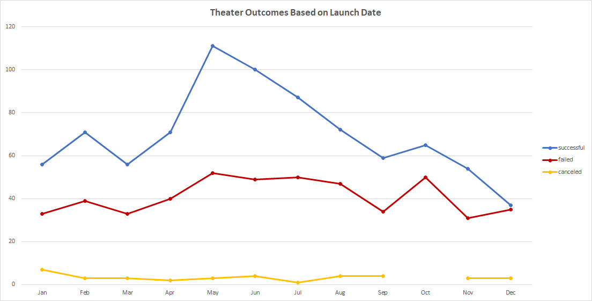
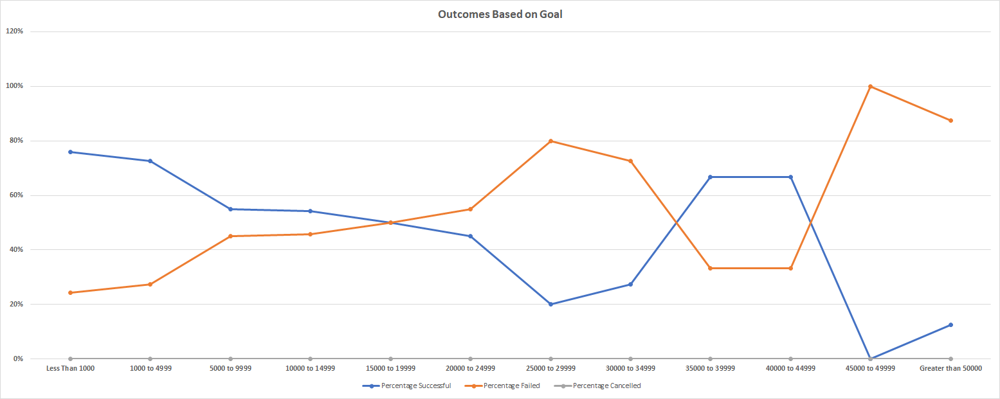

# Kickstarting with Excel

## Overview of Project
This project utilizes Microsoft Excel tools to evaluate the success or failure of Kickstarter campaigns for Louise's play "Fever". Specifically, the project analyzes data correlation in a large data set between goal amounts and outcomes (i.e. success or failure), and launch dates and outcomes.

## Analysis and Challenges
To perform the analysis, a pivot table and line graph were created to visually represent and more easily compare the correlations.  

### Outcomes vs. Months
A pivot table was created to easily arrange data and filter to appropriate years and categories for launch months and outcomes. For the purposes of this project, categories were filtered to "theater," "all" years, and display data for all months. By doing so, we might easily and quickly view the potential correlations between success (or the lack thereof) and campaign start months.
#### Outcomes vs. Months Pivot Table

### Outcomes vs. Goals
A standard table utilizing the COUNTIFS function was used to filter the appropriate data, and easily create a line graph to illustrate success or failure based on goal amounts and outcomes.  By doing so, we might easily and quickly view the potential correlations between success (or the lack thereof) and goal amounts.
#### Example "COUNTIFS" Formula:  
=COUNTIFS(Kickstarter!$F:$F,"successful",Kickstarter!$D:$D,">=1000",Kickstarter!$D:$D,"<=4999",Kickstarter!$R:$R,"plays")
#### Outcomes vs. Goals Table

### Challenges
Few challenges were encountered.  One notable exception was in the copying of cell formulae in the percentage columns to other columns for the Outcomes Based on Goals table.  the "$" operator was inappropriately used to reference the denominator, thus locking the referenced cell inappropriately for all percentage values.  Removing and re-replicating the formula fixed the problem immediately.

Possible other issues that could (but did not) occur include accidentally changing data values in the original data set, accidentally referencing wrong cells or columns in the data, a 0% cancelled result for all monetary ranges in the Outcomes vs. Goals table may have caused confusion and caution, but a quick verification of the results upheld the 0% results.

## Results
### Outcomes Based on Launch Date

The number of successful and failed campaigns are highest in the month of May.  Failures spike to their second highest number in October.  Successful campaigns decrease steadily throughout the year and failed campaigns stay relatively constant. 

### Outcomes Based on Goals

Unsurprisingly, campaigns with goals of less than $1000 have the highest rate of success.  Again unsurprisingly, failure rates increase until campaigns between $15,000 and $19,999 have an almost equal chance of success and failure, with higher amounts understandably continuing to have higher rates of failure than success.  Interestingly, campaigns with goals of $35,0000 to $44999 are more likely to be successful before returning to the expected trend after the $50,000 goal mark.

### Limitations of the Data Set
The data set that was chosen to analyze Outcomes Based on Launch Date includes all theater categories.  This data set would be more relevant to Louise's play if the data was filtered to the "play" subcategory alone, as we did with the Outcomes Based on Goals analysis.  There were likely statistical outliers skewing the Outcomes Based on Goals data as well.  Adjusting our analysis once these outliers are determined with a box-and-whisker-plot graph and removed from the data set would make the data far more useful. Finally, while percentages are helpful, relatively small numbers of total data points may mean there isn't enough data to appropriately analyze (there are only 20 data points total beyond a $35,000 goal).  Some of these may be considered outliers; we may also investigate the standard deviations of these very large and very small data points.

### Final Recommendations
Louise should start her campaign in May and may consider increasing her budget (there is only a slightly greater than 50% chance of success for a $12,000 goal as described earlier in the module) to between #35,000 and $49,999.  However, I would recommend an analysis that includes a box-and-whisker-plot graph of the data as well as an analysis of standard deviations of very high and very low values before making a final decision.
